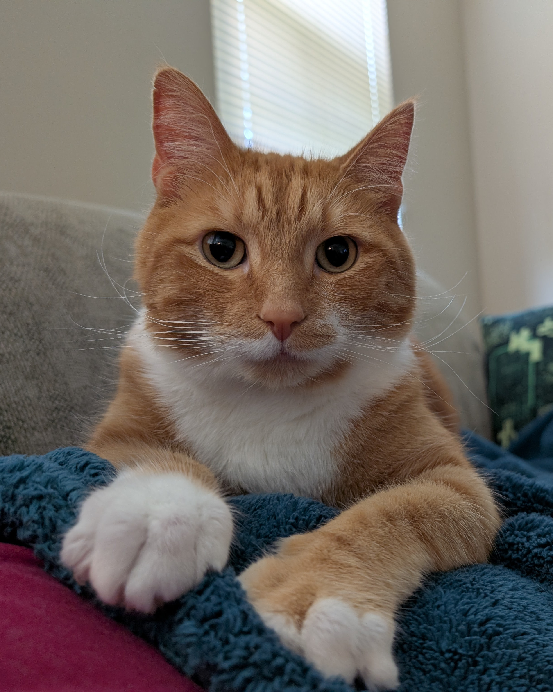

I'm  years old and live in Rochester NY.

I enjoy traveling, looking at space through my telescope, playing video games, and programming.

I have a  year old cat named Felix. He's a good boy.

I graduated from RIT in 2015 with a bachelors degree in Computer Engineering.

Currently, I am a Senior Software Engineer at Six-15 Technologies in Rochester NY. Six-15 designs and manufactures head mounted display systems.
My work is primarily in 2 areas: Android applications, and RTOS / bare-metal firmware. My work also involves customer integrations, dev-ops, and internal tools.

